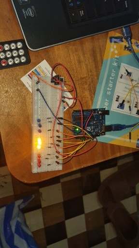

# ARDUINO-TELECOMMANDE-IR-9LEDS
Controle de 9 LEDS via télécommande IR + mode chenille et alternance sur Arduino UNO
## FONCTIONALITES
- 9 LEDS  sur pin 2 à 10
- Réception IR via VS1838B  sur pin 11
- Touche 1-9 : allume/éteint chaque LEDS
- Touche ok fait une Alternance  repeter quand les 3 leds du mileu son allumer les trois a gauche et droite son eteint et le contraire dans une seconde
- Touche droite mode chenille droite à gauche
- touche gauche mode chenille gauche à droite
- ok pour eteindre tout le dispositif si il es en mode alternance et ok de fois si il es sure autres mode quelconque
## MATERIEL
  - Arduino UNO
  - 9 LEDS 3xrouge 3xjaune 3xbleu + 9 résistance 220R
  - Récepteur IR VS1838B
  - Télécommande 15 touche
## LIBRAIRIE
  IRremote by shirriff
## PHOTO DU MONTAGE
  
  *Arduino UNO + 9 LEDs RYB + Récepteur IR VS1838B + Télécommande 15 touche*
## AUTEUR
  LUC977
